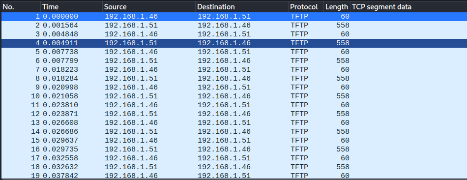
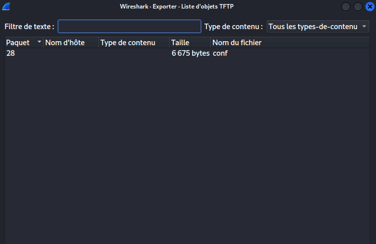
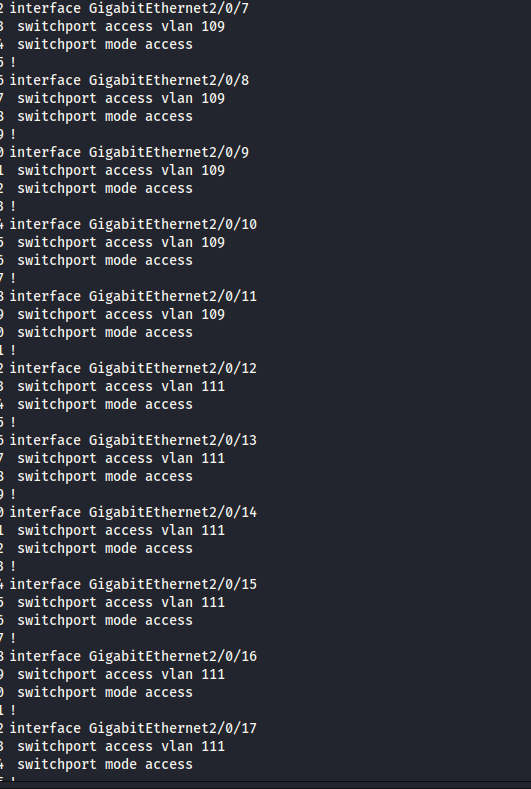
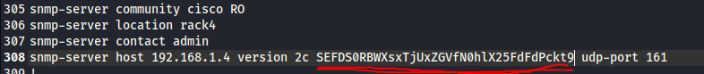

# Baby foren

In this challenge we only have a .pcap file.
Let's open it in wireshark :

We can clearly see some TFTP (Trivial File Transfer Protocol) going on so let's check for some file : 

In file ==> export object, we find this : 

we then extract the file and see what's in it. 

---

We can understand that it is a cisco configuration file with the multiple interface configuration : 

Finally we find a strange string in the file : 

## SEFDS0RBWXsxTjUxZGVfN0hlX25FdFdPckt9

we try to decode it in base64 and we find the flag : 

## HACKDAY{1N51de_7He_nEtWOrK} 
