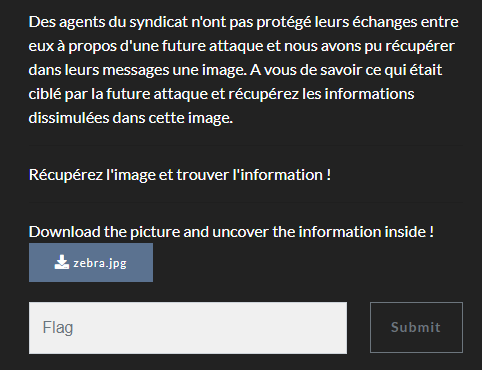

# Baby steganography

We're given this .jpg file
Nothing interesting in metadatas to be found so we must take a look at it

At first glance we can't deduce a lot of things.

We first thought of some kind of puzzle where we could merge certain part of the drawing to make a particular drawing appear giving us hints for the next steps.
But the fact that every first lines were pointing *down right* and never *down left* hinted us that nothing could be merged.

Starting from scratch again We noticed a few interesting facts
1. after verifications, some rows were identical
2. every first lines were pointing *down right*
3. every rows were **exactly** 8 lines long
4. the name of the file is usually a hint : **zebra**

The first point hints us that 1 row probably corresponds to a character, and every rows put together gives us the flag.

The second ,third and 4th points hints us that some binary conversion is involved

after a bit of creativity with paint we came up with this
 

Every *down right* lines are a 0
Every *down left* lines are a 1

when putting all the 8bits rows in a binary to text converter we finally get the flag : 

