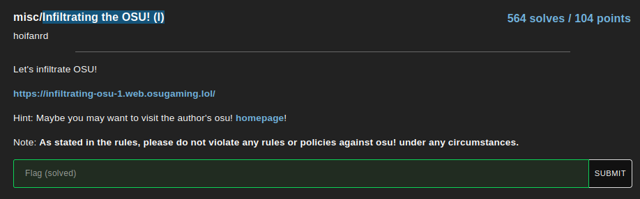

# Infiltrating the OSU! (I)

This challenge is pretty simple

We ask you to go on a site and you have a hisnt with a link to a profile page :

- the website page

Website text

 Let's inflitrate osu!
    Please send me a link of the above photo under the domain assets.ppy.sh

- the profile page

if we open the image on the profile page in a new tab we can see the link correspond : 

https://assets.ppy.sh/user-profile-covers/13336293/e20fc9c84f8f20881bfa0bb70bbcb68c6b50bb25dc96cf608e431a7f9f482c25.jpeg

from here, we juste send the link on the website and get the flag

## Congrutations! Here's your flag: osu{tr1v4l_5rc_1n5p3c7_1n_webs1t3}