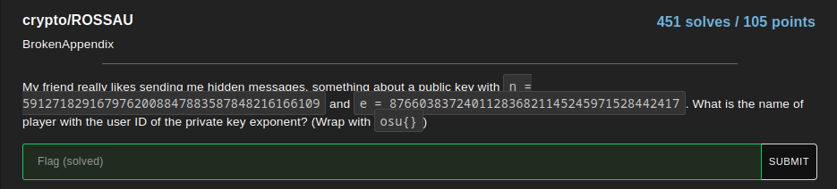
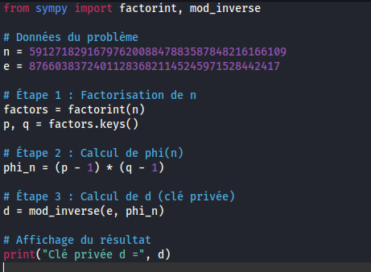
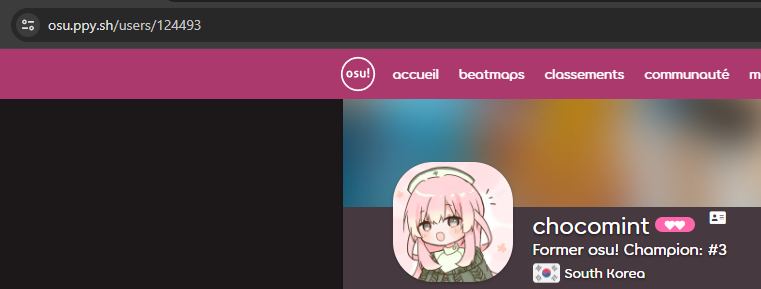

# ROSSAU

In this challenge, we give you a few variables corresponding to the public key, the idea is to calculate the private key : 

here is the code I used :

here is the key I obtained : 

### d = 124493

And now, we have to look the the player with the ID corresponding to this private key : 

and so the flag was : 

## osu{chocomint}