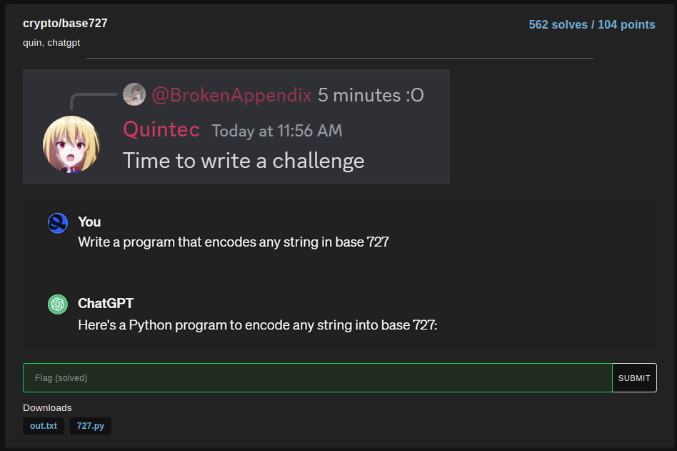
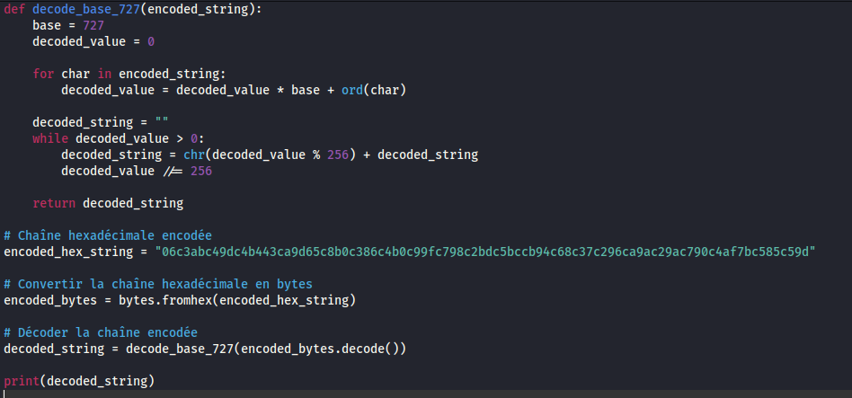

# base727

In this challenge, we only have an output text file and a python code that encode in base 727 : 

So we have to decode in base 727, here the code I used : 

and here is the flag : 

## osu{wysiwysiwysiywsywiwywsi}