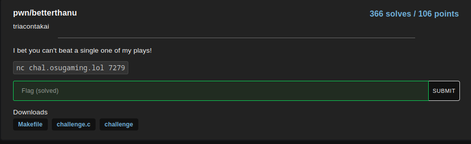

# betterthanu

This challenge is a simple bufferoverflow

We ask you to beat a specific score and you have a .c file:

- the .c file

- the interesting part is in this code is that first, the string is stocked in a simple array and the method used to get the string is fgets() wich the basic context of a buffer overflow. 
Also here, we can see that the program cheat with the line my_pp = pp + 1
this confirm that we have to do a buffer overflow to write in the memory of my_pp variable the memory
Finally to get the flag we need to have pp = 727 so when the program ask you put 727

Here is the final result

## Here have the flag: osu{i_cant_believe_i_saw_it}